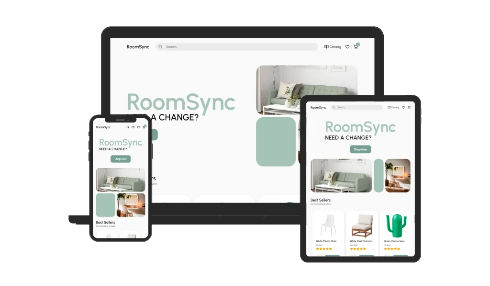

 <div align="center" valign="center">
  <h1 valign="center"> 
    
    RoomSync
    
  </h1> 
  Designed & coded with ♥ by Pedro Ramos
  <br><br>

  [](https://angular.io/)
  [](https://www.typescriptlang.org/)
  [](https://sass-lang.com/)
  [![Karma](https://img.shields.io/badge/Karma-f7f7f7?style=for-the-badge&logo=data:image/svg%2bxml;base64,PD94bWwgdmVyc2lvbj0iMS4wIiBlbmNvZGluZz0iVVRGLTgiIHN0YW5kYWxvbmU9Im5vIj8+CjwhRE9DVFlQRSBzdmcgUFVCTElDICItLy9XM0MvL0RURCBTVkcgMS4xLy9FTiIgImh0dHA6Ly93d3cudzMub3JnL0dyYXBoaWNzL1NWRy8xLjEvRFREL3N2ZzExLmR0ZCI+CjxzdmcgdmVyc2lvbj0iMS4xIiBpZD0iTGF5ZXJfMSIgeG1sbnM9Imh0dHA6Ly93d3cudzMub3JnLzIwMDAvc3ZnIiB4bWxuczp4bGluaz0iaHR0cDovL3d3dy53My5vcmcvMTk5OS94bGluayIgeD0iMHB4IiB5PSIwcHgiIHdpZHRoPSIxNnB4IiBoZWlnaHQ9IjE2cHgiIHZpZXdCb3g9IjAgMCAxNiAxNiIgZW5hYmxlLWJhY2tncm91bmQ9Im5ldyAwIDAgMTYgMTYiIHhtbDpzcGFjZT0icHJlc2VydmUiPiAgPGltYWdlIGlkPSJpbWFnZTAiIHdpZHRoPSIxNiIgaGVpZ2h0PSIxNiIgeD0iMCIgeT0iMCIKICAgIGhyZWY9ImRhdGE6aW1hZ2UvcG5nO2Jhc2U2NCxpVkJPUncwS0dnb0FBQUFOU1VoRVVnQUFBQkFBQUFBUUNBTUFBQUFvTFE5VEFBQUFCR2RCVFVFQUFMR1BDL3hoQlFBQUFDQmpTRkpOCkFBQjZKZ0FBZ0lRQUFQb0FBQUNBNkFBQWRUQUFBT3BnQUFBNm1BQUFGM0NjdWxFOEFBQUJaVkJNVkVVQUFBQTl2NjQ5djY0OXY2NDkKdjY0OXY2NDl2NjQ5djY0OXY2NDl2NjQ5djY0OXY2NDl2NjQ5djY0OXY2NDl2NjQ5djY0OXY2NDl2NjQ5djY0OXY2NDl2NjQ5djY0OQp2NjQ5djY0OXY2NDl2NjQ5djY0OXY2NDl2NjQ5djY0OXY2NDl2NjQ5dnEwOXY2NDl2NjQ5djY1QzFjUTVyWnc5d0s4OHZLczhwcGMrCnZxNDl2NjQ5d0s4OHU2bzNvNUlBQUFBK3diQTl3SzgzbzVJMGxZUTFtNG85dnEwNXJwMDFtb2xDMDhJOXdLODVySnMxbll3MW5JczEKbklzOXdiQTJuWXcxbklzOXZxMDh1cWsxbTRvMW5JczFuSXMxbklzOXdLODZyNTRvWFV3MW5ZdzFuWXcrd3JFMG1JYzFuSXMxbklzNgpzcUUyb1pBMW5JczFuWXd5a0g4K3hiUTl3YkFLQUFBMW5ZdzFuSXMxbklzNG81STFuWXcxbll3MG1vbE0vL0U5dnEwMW5vMDFuSXMxCm5JczFuSXM3dDZZNXJwMDFuWXc5djY0OXdLODJvcEUxbklzMW5JczFuSXM5djY0OXdLODh2NjQ5d3JFMW1vazh1cWsxbklzMW5Zei8KLy84NnJsbkxBQUFBYm5SU1RsTUFBUU1ORGdVTUR3STI4ZkQ5WUp6Kzd2ZFJPVmhGKzV1QzA5WVJNL3p6UW53TjVJaWpDRkNpMkFjQgpSbldLK3dOai9mZzlBK0w4U1JqKy9OTVJBYWJlak5EVTgvMlhBM0RCQ3EzZVdJdjVUaFlSRGNJcFFHQUQzTjhmQVFNcFBRVm1TdmJ2CnB3RUJBUXNHQVF3U0FqSmt6M0lBQUFBQllrdEhSSFl4WThsQkFBQUFCM1JKVFVVSDV3a0dFQVlqQi9YSnN3QUFBT0pKUkVGVUdOTkYKajBkYndsQVVSRTlDQUV2a1ljTWFHL2JldTJMQjNySDNibFQwb2hqL3Z5K3k0QzdPTjNOV2N5Ri9SajZhZ1lBVkpHaUZ3cFpmQ3lncwpLclpMaUtob2FWbE9sQ3RiS2lvbEpsVzZHYjZ3bFZUWGlOVFdnWVZoVW0rTDA2Q1VOR0xTRk5Kb2JoRWxqc1IxSk5KS1d6c2RFbk15Cm5WMTBRNC8wOXZVUERJb3o5RFU4d2lpRXg3N0hzeE9Uamt4TloyZG1tWVA1bjRTM3dHSm1hVG5wcmJBS2Erc2JtMXZFWlh2bmQ5ZmIKMDdQMkQwZ2RIaDNMeWVtWjU1MWZhSE41eGZYTmJmU08rNGZINUJNOHYrQzY4UHJHZXpxVi9zaDk2Lzd6MDhjZmRvd242RzY5cVgwQQpBQUFsZEVWWWRHUmhkR1U2WTNKbFlYUmxBREl3TWpNdE1Ea3RNRFpVTVRZNk1EWTZNelVyTURBNk1EQlVkVmtqQUFBQUpYUkZXSFJrCllYUmxPbTF2WkdsbWVRQXlNREl6TFRBNUxUQTJWREUyT2pBMk9qTTFLekF3T2pBd0pTamhud0FBQUNoMFJWaDBaR0YwWlRwMGFXMWwKYzNSaGJYQUFNakF5TXkwd09TMHdObFF4Tmpvd05qb3pOU3N3TURvd01ISTl3RUFBQUFBQVNVVk9SSzVDWUlJPSIgLz4KPC9zdmc+Cg==)](https://karma-runner.github.io/6.4/index.html)
  [](https://jasmine.github.io/)
  
</div>
<br>

## Preview




## Installation

To clone and run this application, you'll need [Git](https://git-scm.com) and [Node.js](https://nodejs.org/en/download/) (which comes with [npm](http://npmjs.com)) installed on your computer. From your command line:

```bash
# Clone this repository
$ git clone https://github.com/pedrorxmos/roomsync-e-commerce

# Go to the project directory
$ cd roomsync-e-commerce

# Install dependencies
$ npm install

# Run the app
$ npm run start
```

## Deployment

To deploy this applicattion, you have to use:

```bash
$ npm run build
```


## My Links
- Portfolio: [pedrorxmos.com](https://pedrorxmos.com)
- Github: [@pedrorxmos](https://github.com/pedrorxmos)
- LinkedIn: [@pedroramosguardiola](https://linkedin.com/in/pedroramosguardiola)
- Twitter: [@pedrorxmos](https://twitter.com/pedrorxmos)
- Mail: [pedrorxmosdev@gmail.com](mailTo:pedrorxmosdev@gmail.com)
